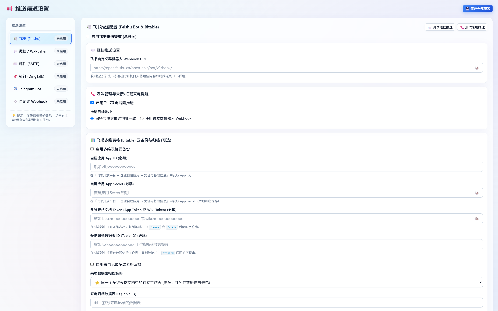

# 📢 SimSync 多渠道推送与飞书多维表格配置指南

SimSync 支持将接收到的蜂窝短信与未接来电实时推送到多种渠道，并支持将历史数据云端归档至**飞书多维表格 (Bitable)**。

所有推送渠道均支持：
- **短信与来电独立控制**：可分别为短信与来电设置不同的开关、独立的接收人或独立的 Webhook。
- **Web 端一键测试**：在 Web 控制台的「📢 推送渠道设置」中可实时发送测试卡片。
- **磁盘加密存储**：开启 AES-256 加密后，所有 Webhook Token、邮箱密码等均以密文形式存储在 `config.yaml` 中。

<p align="center">
  
</p>

---

## 目录

- [一、飞书 (Feishu / Lark) 配置指南](#一飞书-feishu--lark-配置指南)
  - [1.1 方式 A：自定义群机器人 Webhook](#11-方式-a自定义群机器人-webhook)
  - [1.2 方式 B：飞书多维表格 (Bitable) 云备份与归档（详细表格设置）](#12-方式-b飞书多维表格-bitable-云备份与归档详细表格设置)
  - [1.3 本地历史短信与多维表格比对补录](#13-本地历史短信与多维表格比对补录)
- [二、微信推送配置指南 (企业微信 / WxPusher)](#二微信推送配置指南-企业微信--wxpusher)
  - [2.1 企业微信群机器人](#21-企业微信群机器人)
  - [2.2 WxPusher 微信个人公众号推送](#22-wxpusher-微信个人公众号推送)
- [三、钉钉 (DingTalk) 群机器人配置指南](#三钉钉-dingtalk-群机器人配置指南)
- [四、邮件推送 (SMTP) 配置指南](#四邮件推送-smtp-配置指南)
- [五、Telegram 机器人配置指南](#五telegram-机器人配置指南)
- [六、自定义 Webhook 回调规范](#六自定义-webhook-回调规范)

---

## 一、飞书 (Feishu / Lark) 配置指南

飞书渠道支持两种方式，两者可同时启用，互不干扰：
1. **群机器人 Webhook**：实时将短信与来电以富文本消息卡片的形式推送到群聊。
2. **多维表格 (Bitable)**：自动将短信与来电实时追加到云端多维表格中，作为持久化备份与查询底表。

---

### 1.1 方式 A：自定义群机器人 Webhook

1. 在飞书客户端中进入需要接收通知的群聊。
2. 点击右上角 **设置**（或群头像） &rarr; **群机器人** &rarr; **添加机器人** &rarr; 选择 **自定义机器人**。
3. 输入机器人名称（如 `SimSync 验证码转发`），点击添加。
4. 复制生成的 **Webhook 地址**：
   ```
   https://open.feishu.cn/open-apis/bot/v2/hook/xxxxxxxx-xxxx-xxxx-xxxx-xxxxxxxxxxxx
   ```
5. 在 SimSync Web 控制台「推送渠道设置」中粘贴该 URL，并勾选启用飞书推送。
6. **来电独立 Webhook**（可选）：若希望将未接来电推送到另一个群聊，可开启“使用独立来电 Webhook”并填入对应的群机器人地址。

---

### 1.2 方式 B：飞书多维表格 (Bitable) 云备份与归档（详细表格设置）

使用多维表格归档需要通过飞书开放平台的自建应用进行授权写入。

#### 步骤 1：在飞书开放平台创建自建应用
1. 登录 [飞书开放平台开发者后台](https://open.feishu.cn/app)。
2. 点击 **创建企业自建应用**，填写应用名称（如 `SimSync 数据助手`）和描述。
3. 进入应用详情页，在 **凭证与基础信息** 页面获取：
   - **App ID**（形如 `cli_xxxxxxxxxxxxxxxx`）
   - **App Secret**（点击复制）
4. 进入 **权限管理**，搜索并开通以下权限：
   - `bitable:app`（查看、评论、编辑和管理多维表格）
   - *（如果多维表格存放于知识库 Wiki 中）* 补充开通 `wiki:wiki:readonly`（获取知识库节点信息）
5. 进入 **版本管理与发布**，点击 **创建版本**，填写版本号，点击 **申请发布**（企业自建应用通常可免审即时生效）。

#### 步骤 2：创建多维表格并配置字段结构

在飞书个人云文档或知识库中新建一个 **多维表格**，按以下要求设置工作表与字段名称：

##### 1. 短信数据工作表（必须严格匹配字段名）

工作表名称可自定（如 `短信记录`），请添加以下 5 个字段（列）：

| 字段名称（必须完全一致） | 推荐字段类型 | 说明 |
| :--- | :--- | :--- |
| **本机号码** | 文本 | 接收短信的 SIM 卡本机号码（便于多卡区分归档） |
| **发件人** | 文本 | 短信发送者号码（如 `10010`、`95555` 等） |
| **短信内容** | 文本 / 多行文本 | 短信的完整正文内容 |
| **接收时间** | 文本 / 日期时间 | 短信接收时间，格式如 `2026-09-22 15:30:00` |
| **短信中心** | 文本 | 发信运营商短信中心号码 (SMSC) |

> 💡 **提示**：字段名称必须与上表加粗名称**完全一致**（区分大小写，不要带空格）。若多维表格中有默认的“文本”或“多选”空列，请重命名或删除多余的必填列。

##### 2. 来电数据工作表（可选）

来电记录多维表格归档支持三种模式：

- **模式 1：同文档独立工作表（`same_base`，推荐）**  
  在同一个多维表格中点击底部的 **“+”** 新建一个工作表（如命名为 `来电记录`），字段设置如下：
  | 字段名称（必须完全一致） | 推荐字段类型 | 说明 |
  | :--- | :--- | :--- |
  | **本机号码** | 文本 | 接收来电的 SIM 卡本机号码 |
  | **来电号码** | 文本 | 来电对方号码 |
  | **处理动作** | 文本 | 挂断动作说明（如 `已自动挂断（防漫游扣费）`） |
  | **发生时间** | 文本 / 日期时间 | 来电时间，格式如 `2026-09-22 15:30:00` |

- **模式 2：同工作表（`same_table`）**  
  与短信共用同一个工作表。来电记录将写入：
  - `发件人` = 来电对方号码
  - `短信内容` = `[来电提醒] 已自动挂断（防漫游扣费）`
  - `短信中心` = `语音呼叫`

- **模式 3：完全独立文档（`custom`）**  
  使用另一套独立的多维表格文档，需填入独立的 `call_app_token` 与 `call_table_id`，字段要求同模式 1。

#### 步骤 3：将自建应用添加为多维表格协作者（⚠️ 关键步骤）

飞书的安全机制要求：自建应用不仅需要具备 API 权限，还**必须被显式邀请为该文档的协作者**，否则调用 API 时将提示权限不足错误。

1. 打开刚刚创建的飞书多维表格。
2. 点击右上角 **分享** 按钮 &rarr; 点击 **添加协作者**。
3. 在搜索框中输入在步骤 1 中创建的自建应用名称（如 `SimSync 数据助手`）。
4. 权限选择 **可编辑**，点击确定完成添加。

#### 步骤 4：提取 `app_token` 与 `table_id`

在浏览器中打开多维表格，观察地址栏 URL：

- **标准多维表格 URL 格式**：
  ```
  https://my-company.feishu.cn/base/bascnAbCdEfGhIjKlMnOpQrStUv?table=tbl1234567890
                                    └─── app_token ────────┘       └── table_id ─┘
  ```
  - **App Token**：`base/` 后面的一串字符串（通常以 `bascn` 开头）。
  - **Table ID**：`?table=` 后面的一串字符串（以 `tbl` 开头）。

- **知识库 (Wiki) 节点多维表格 URL 格式**：
  ```
  https://my-company.feishu.cn/wiki/wikcnAbCdEfGhIjKlMnOpQrStUv?table=tbl1234567890
  ```
  - SimSync 原生支持直接填入 `wikcn...` 节点 Token，系统后台会自动通过飞书接口转换为真实的底层 `bascn` App Token。

#### 步骤 5：在 SimSync Web 控制台保存与测试
1. 进入「📢 推送渠道设置」&rarr; 飞书卡片下的 **飞书多维表格 (Bitable) 云备份与归档**。
2. 勾选 **启用多维表格云备份**。
3. 填入：
   - 飞书自建应用 `App ID` 与 `App Secret`
   - 短信多维表格 `App Token` 与 `Table ID`
   - （可选）勾选启用来电多维表格归档，选择归档模式并填入对应的 `Table ID`。
4. 点击卡片下方的 **💾 保存配置**。
5. 点击 **🧪 发送测试卡片**，若多维表格中成功插入一行测试数据，说明配置完全正确。

---

### 1.3 本地历史短信与多维表格比对补录

在 Web 控制台的飞书多维表格设置区下方，提供了 **“🔄 本地历史短信与多维表格比对补录”** 功能：

- **智能指纹去重**：以 `(发件人号码 + 短信正文 + 接收时间)` 生成唯一指纹。
- **隔离本机号**：仅比对并同步当前绑定 SIM 卡的短信，避免多卡数据混淆。
- **自动补录缺失**：即使系统离线一段时间或换机部署，点击一次即可将本地数据库中存在、但飞书表格中缺失的历史短信一次性批量同步至飞书，实现无缝云端归档。

---

## 二、微信推送配置指南 (企业微信 / WxPusher)

SimSync 提供两种微信推送方式：
1. **企业微信群机器人**（推荐团队或已使用企微的用户）
2. **WxPusher 微信推送**（适合个人用户，关注公众号即可直接收到推送）

### 2.1 企业微信群机器人

1. 在企业微信电脑端或手机端，进入任意内部群聊。
2. 右键群聊或点击群设置 &rarr; **添加群机器人** &rarr; 新建机器人。
3. 复制生成的 Webhook 地址：
   ```
   https://qyapi.weixin.qq.com/cgi-bin/webhook/send?key=xxxxxxxx-xxxx-xxxx-xxxx-xxxxxxxxxxxx
   ```
4. 在 SimSync Web 端选择模式为 **企业微信群机器人 (WeCom Bot)**，粘贴 Webhook URL 并保存。

### 2.2 WxPusher 微信个人公众号推送

1. 浏览器访问 [WxPusher 开放平台](https://wxpusher.zjiecode.com/) 并微信扫码登录。
2. 在后台点击 **创建应用**，填写应用名称，获取 **App Token**（形如 `AT_xxxxxxxxxxxxxxxxxxxxxxxxxxxx`）。
3. 进入 **关注应用** 页面，微信扫描该应用的二维码关注公众号。
4. 在后台 **用户列表** 中查看您个人的 **UID**（形如 `UID_xxxxxxxxxxxxxxxxxxxxxxxxxxxx`）。
5. 在 SimSync Web 端选择模式为 **WxPusher 个人微信推送**，填入 `app_token` 与用户 `UID`（支持填入多个 UID，以英文逗号分隔）。

---

## 三、钉钉 (DingTalk) 群机器人配置指南

1. 打开钉钉电脑端，进入目标群聊 &rarr; **群设置** &rarr; **机器人** &rarr; **添加机器人** &rarr; 选择 **自定义 (通过 Webhook 接入)**。
2. 安全设置建议勾选以下任一方式：
   - **加签**（推荐）：复制生成的 `SEC...` 密钥，填入 SimSync 的 **加签密钥 (Secret)** 框中。
   - **自定义关键词**：填入 `短信` 或 `SimSync`。
3. 复制生成的 Webhook 地址并粘贴至 SimSync 控制台。

---

## 四、邮件推送 (SMTP) 配置指南

邮件推送适用于将验证码、未接来电直接发送到您的常用邮箱，同时也是**忘记密码时在线接收 6 位验证码**的关键渠道。

### 常见邮箱 SMTP 配置参考

| 邮箱服务商 | SMTP 主机 | 端口 | SSL 开关 | 密码要求 |
| :--- | :--- | :---: | :---: | :--- |
| **Outlook / Office365** | `smtp-mail.outlook.com` | `587` | **关闭** (STARTTLS) | 微软账号密码 / 应用专用密码 |
| **QQ 邮箱 / Foxmail** | `smtp.qq.com` | `465` | **开启** (SSL) | 邮箱设置中生成的 **16位授权码** |
| **163 网易邮箱** | `smtp.163.com` | `465` | **开启** (SSL) | 邮箱设置中生成的 **客户端授权密码** |
| **Gmail** | `smtp.gmail.com` | `587` 或 `465` | 587关 / 465开 | 谷歌账号的 **应用专用密码** (需开启两步验证) |
| **腾讯企业邮** | `smtp.exmail.qq.com` | `465` | **开启** (SSL) | 企业微信/企业邮客户端专用密码 |

> ⚠️ **注意**：绝大多数国内邮箱（QQ、163 等）均不能使用邮箱的网页登录密码，必须在邮箱网页版的“设置 -> 账户 -> POP3/IMAP/SMTP”中生成专门的 **客户端授权码** 作为密码。

---

## 五、Telegram 机器人配置指南

1. 打开 Telegram，搜索官方账号 `@BotFather`，发送 `/newbot` 指令。
2. 按照提示输入机器人名称与用户名，获取 **Bot Token**：
   ```
   123456789:ABCdefGHIjklMNOpqrSTUvwxYZ
   ```
3. 获取您的个人或群组 **Chat ID**：
   - 搜索并向 `@userinfobot` 发送任意消息，即可获取您的数字 `Id`。
   - 若推送到群组，将机器人拉入群组，并在群内发言后访问 `https://api.telegram.org/bot<YourBotToken>/getUpdates` 查看群组 `chat_id`（通常以负号开头）。
4. **网络代理设置（国内网络必需）**：
   - 若 Docker 宿主机无法直接访问 Telegram API，可在控制台填入 HTTP 或 SOCKS5 代理地址：
     ```
     http://127.0.0.1:7890
     ```

---

## 六、自定义 Webhook 回调规范

如果您有自己的后端系统、自动化工作流（如 n8n / Node-RED）或 Home Assistant，可启用自定义 Webhook。

SimSync 将以 `POST` 请求（Content-Type: `application/json`）向您指定的 URL 发送数据：

### 1. 短信接收 Payload 格式
```json
{
  "event": "sms_received",
  "data": {
    "sender": "+8613800138000",
    "content": "【招商银行】您尾号 8888 的信用卡消费人民币 100.00 元。",
    "readable_date": "2026-09-22 15:30:00",
    "timestamp": 1790062200,
    "receiver": "+8613900000000",
    "smsc": "+8613800755500",
    "is_complete": true
  }
}
```

### 2. 来电未接 Payload 格式
```json
{
  "event": "call_received",
  "data": {
    "caller": "+8613912345678",
    "receiver": "+8613900000000",
    "action": "hangup",
    "action_desc": "已自动挂断（防漫游扣费）",
    "timestamp": 1790062215,
    "readable_date": "2026-09-22 15:30:15"
  }
}
```

---

## 🔐 安全提示：磁盘数据加密 (AES-256)

所有渠道的配置在 Web 界面保存后将立即写入 `config.yaml`。

为防止服务器磁盘文件泄露导致 Token 或授权码失窃，推荐在控制台 **「🔐 安全与 2FA」** 中开启 **“本地敏感数据加密存储”**：
- 开启后，所有的 `webhook_url`、`app_secret`、`smtp password` 等字段在写入磁盘时均会自动转换为 `enc:...` 强加密密文。
- 系统在内存中透明解密使用，兼顾便捷性与安全性。
