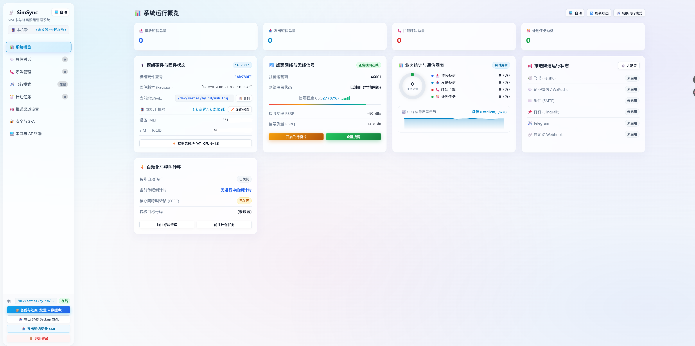
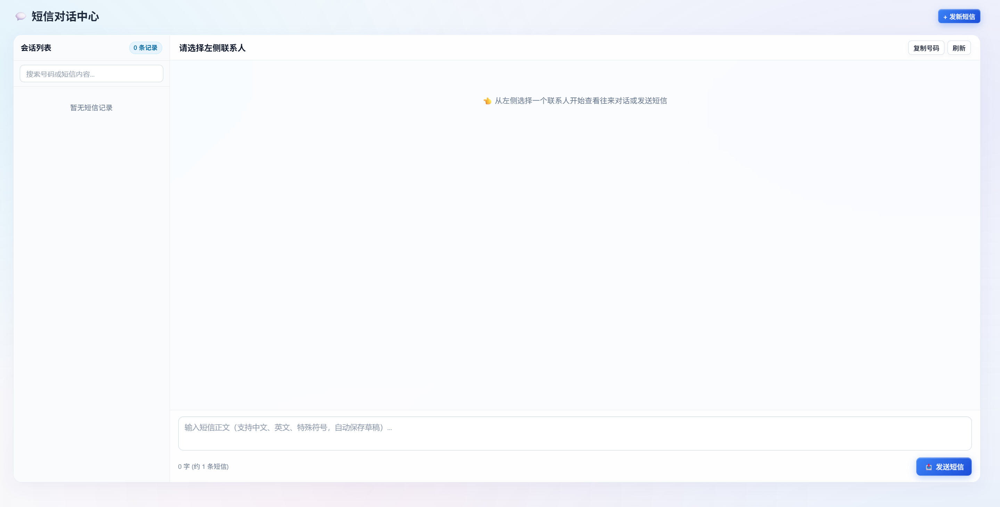
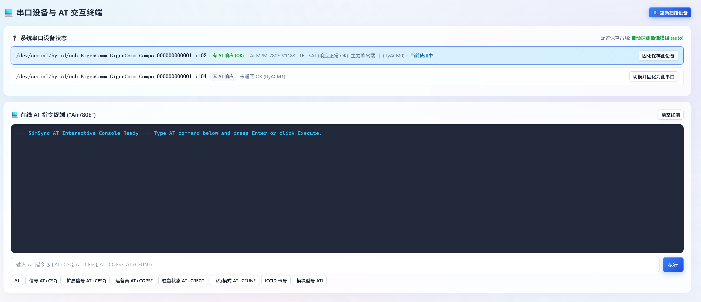

# SimSync - 智能蜂窝模组与 SIM 卡管理中心

<p align="center">
  <strong>基于 4G 蜂窝模组的短信收发、来电拦截、呼叫转移与保号管理平台</strong><br>
  运行于 Docker / Linux 宿主机环境<br>
  <strong>100% 绝对 0 漫游流量消耗规范 · 现代简洁 Web 控制台 · 多渠道告警推送 · 2FA 安全防护</strong>
</p>

<p align="center">
  <a href="#deploy"><b>🚀 极速部署</b></a> &nbsp;•&nbsp;
  <a href="#notifications"><b>📢 推送设置指南</b></a> &nbsp;•&nbsp;
  <a href="NOTIFICATIONS.md"><b>📖 推送配置详细文档</b></a> &nbsp;•&nbsp;
  <a href="#hardware"><b>🛠️ 硬件与串口</b></a> &nbsp;•&nbsp;
  <a href="#config"><b>⚙️ 配置文件说明</b></a> &nbsp;•&nbsp;
  <a href="#faq"><b>❓ 常见问题 FAQ</b></a>
</p>

<!-- 🖼️ 建议截图位置 1：项目门面图（Web 控制台首页概览，建议保存为 docs/images/dashboard.png 并取消下方注释） -->
<!--
<p align="center">
  
</p>
-->

---

<a id="features"></a>
## 🌟 核心特性

### 1. 🛡️ 100% 绝对 0 漫游流量消耗
- **完全杜绝蜂窝拨号**：系统宿主机仅通过 USB 虚拟串口（`/dev/ttyUSB*` 或 `/dev/ttyACM*`）向模组发送纯文本 AT 指令，**从不运行任何数据拨号服务**（无 `pppd`、无 `ModemManager`、无 `rndis` 驱动），系统内核不存在任何蜂窝数据网卡。
- **纯本地内网处理**：所有短信转发、云端归档、Web 管理流量均走家庭千兆宽带/局域网，彻底隔绝海外卡漫游流量意外扣费。

### 2. 🖥️ 现代简洁 Web 控制台
- **全端自适应布局**：支持 PC 桌面端与移动端，适配常见分辨率与超宽屏，卡片指标与图表自适应排版。
- **移动端专属抽屉**：针对手机端浏览优化，配备平滑侧滑导航抽屉与快捷操作栏，随时随地查看状态与收发短信。

### 3. 📱 本机手机号码自动识别与管理
- **自动读取 (AT+CNUM)**：开机与刷新状态时自动向 SIM 卡下发 `AT+CNUM` 指令读取本机号码（MSISDN）。
- **手动设置与双重持久化**：国内各大运营商出厂通常未将号码写入 SIM 芯片，用户可在 Web 界面直接录入修改。系统不仅将号码持久化保存至 `config.yaml`，还会尝试通过 `AT+CPBW` 指令将号码同步写入 SIM 卡硬件存储（EF_MSISDN）。
- **全站醒目展示**：在左侧边栏顶端、移动端顶栏以及系统概览卡片中常驻展示。

<a id="chat"></a>
### 4. 💬 IM 气泡式短信对话中心
- **双向即时通讯**：采用类 Telegram / 微信的联系人会话列表与对话气泡流，支持一键发起新对话。
- **会话草稿自动保持**：切换不同联系人时，未发送的文字草稿自动保留在输入框中，无需担心误切换丢失。
- **字数统计与分包估算**：实时统计字符数，自动提示约合几条短信，避免超出计费预期。
- **PDU 工业级解码**：原生支持 UCS2 中文、特殊字符与长短信拼接，`+CNMI` 主动上报秒级推送。

<!-- 🖼️ 建议截图位置 2：短信对话中心气泡流（建议保存为 docs/images/chat.png 并取消下方注释） -->
<!--
<p align="center">
  
</p>
-->

### 5. 📞 呼叫拦截、核心网转移与来电记录
- **0.5s 极速挂断防扣费**：监测到来电振铃（`RING`）瞬时发送 `ATH` 挂断，避免产生高额漫游接听费。
- **核心网呼叫转移 (AT+CCFC)**：在运营商核心网预设转移号码（支持无条件、遇忙、无应答、不可及等条件），平时保持停用，需要时在 Web 界面一键激活或注销。
- **来电日志与导出**：本地详细记录拦截来电历史，支持导出符合 Android 原生标准的通话记录 XML。

### 6. ✈️ 智能飞行模式与定时休眠
- **收发短信自动休眠**：收到或发送短信后，系统延迟 N 分钟自动进入飞行模式（`AT+CFUN=4`，关闭射频电路），杜绝静默搜网信令。
- **发信前自动唤醒**：发送短信或执行计划任务时，自动提前唤醒模组（`AT+CFUN=1`）并等待搜网完成。
- **定时飞行计划**：可创建多组定时计划（例如每天 23:00 自动休眠、07:00 自动唤醒），夜间免打扰且最大化省电。

### 7. ⏰ 定时保号计划任务
- 针对各类海外卡（如澳洲 Aldi Mobile、英国 giffgaff、香港 Club SIM、美国 Ultra Mobile 等）的有效期保号规则，设定定期向特定号码（如运营商余额查询号）自动发送短信，防止停机销卡。

<a id="notifications"></a>
### 8. 📢 6 大多渠道推送与来电独立告警
支持短信与来电独立开启、独立配置推送地址：
- **飞书 (Feishu)**：群机器人 Webhook + 飞书多维表格 (Bitable) 短信与来电双工作表持久化归档；
- **微信推送**：支持企业微信群机器人 (WeCom Bot) 及 WxPusher 微信个人公众号推送；
- **钉钉 (DingTalk)**：群机器人 Webhook，支持加签 (Secret) 与自定义关键词；
- **邮件推送 (SMTP)**：支持 Outlook、QQ、163、Gmail 等各类 SMTP 邮箱；
- **Telegram**：支持 Telegram Bot Token + Chat ID + HTTP/SOCKS5 代理；
- **自定义 Webhook**：支持向任意自有接口 POST JSON 数据（灵活对接 Home Assistant、Node-RED 等自建智能家居服务）；
- **独立来电通知**：所有渠道均支持为未接来电配置独立开关与独立 Webhook。

<!-- 🖼️ 建议截图位置 3：多渠道推送效果或飞书多维表格归档（建议保存为 docs/images/notifications.png 并取消下方注释） -->
<!--
<p align="center">
  
</p>
-->

> 📖 **各渠道详细配置教程、飞书多维表格字段与比对补录规范请参阅**：[多渠道推送与多维表格配置指南](NOTIFICATIONS.md)

### 9. 🔐 公网安全访问与 2FA 双因子认证
- **账号密码认证**：首次访问自动引导初始化注册，密码自动以 SHA-256 散列哈希存储于 `config.yaml`。
- **2FA 双因子认证 (RFC 6238)**：支持基于 TOTP 标准的动态口令（Google Authenticator / 1Password / 微软 Authenticator），一键扫码开启。
- **一次性应急安全码 (Recovery Codes)**：开启 2FA 时自动生成 8 组高强度安全码（如 `A8F2-9K3L`），手机遗失或验证器损坏时可凭任意一组安全码自救登录，验证成功后该码即刻核销作废；支持在 Web 控制台查看剩余码数或重新生成。
- **忘记密码安全重置**：支持向已配置的管理员邮箱发送 6 位临时重置码，或通过 NAS 终端执行单行命令重置密码。
- **Web 服务端口修改**：支持在安全设置中直接修改监听端口，保存后重启生效。

### 10. 💻 串口热扫描与在线 AT 交互终端
- **自动探测有效串口**：开机自动扫描系统串口，发送 AT 握手指令自动锁定真实调制解调器。
- **热切换串口**：发现新设备无需重启，在界面直接切换绑定。
- **交互式 AT 终端**：内置 Web 终端，支持向模组发送任意原始 AT 指令并实时查看回显。

<!-- 🖼️ 建议截图位置 4：交互式 AT 终端执行效果（建议保存为 docs/images/terminal.png 并取消下方注释） -->
<!--
<p align="center">
  
</p>
-->

### 11. 📥 Android 原生 XML 备份与双轨导出
- **SMS Backup & Restore XML**：一键导出标准短信备份 XML，可在手机端使用《SMS Backup & Restore》App 完整无损恢复至手机原生短信。
- **Calls Backup & Restore XML**：一键导出通话记录备份 XML，同步恢复到手机原生通话记录。

### 12. 📦 本地敏感数据加密存储与一键备份还原
- **AES-256 (Fernet) 磁盘加密**：开启后，推送渠道的所有 Webhook URL（含 Token）、密钥与密码在写入本地 `config.yaml` 时均以密文 (`enc:...`) 存储，防止配置误传造成密钥泄露。
- **配置与数据库一键备份还原**：支持一键打包导出 `config.yaml` 与包含全部短信/通话历史的 `simsync.db`（ZIP 格式），换机或重新部署时一键上传还原，无需重新手动填写繁琐的推送渠道参数。

---

<a id="hardware"></a>
## 🛠️ 硬件支持与说明

### 1. 硬件支持说明

- **开发与自用硬件（合宙 Air780 系列）**：
  - 本项目是作者基于手头自用的 **合宙 (LuatOS) Air780 系列**（如 `Air780E` / `Air780EP` 等 4G Cat.1 模组）进行开发和日常自用的。
  - 支持该模组仅是因为作者手头刚好有这块硬件（价格实惠、免驱呈现为标准 USB `cdc_acm` 虚拟串口）。
  - **客观说明**：即便是 Air780 系列，在不同固件版本、不同卡种或特定网络环境下也不排除存在潜在 bug 或异常；作者仅保证在自己的使用场景下可用，若遇到问题欢迎提交 Issue 交流。

- **其他 4G 模组与芯片方案（仅理论支持，未做实测）**：
  - 包括但不限于：移远（Quectel EC20 / EC25 / EC200 系列）、广和通（Fibocom L610 / NL668 系列）、芯讯通（SIMCom SIM7600 / A7670 系列）、紫光展锐（UIS8910DM）、高通（MDM9x07）、翱捷（ASR160x / ASR180x）、海思（Balong 711）等。
  - **说明**：在通信协议层面，这类模组通常均遵循标准 3GPP AT 指令集（TS 27.005 / TS 27.007），底层在 Linux 下多呈现为 `option` 或 `cdc_acm` 驱动的串口设备。因此技术原理上是相通的，但**作者手头并无其他型号硬件，未做过实际真机测试**，不做任何兼容性保证，欢迎有对应设备的朋友自行测试并反馈。

---

### 2. 通信原理与通用性说明

SimSync 之所以理论上可以适用多种 4G 模组，核心在于以下设计：

1. **基于标准 3GPP AT 指令通信**：
   - 短信收发与 PDU 编解码均基于 **3GPP TS 27.005** 与 **3GPP TS 23.040** 规范；
   - 呼叫控制（`ATH` 挂断）、呼叫转移（`AT+CCFC`）、网络驻留（`AT+CREG?`）、信号检测（`AT+CSQ` / `AT+CESQ`）、射频飞行控制（`AT+CFUN`）均基于 **3GPP TS 27.007** 规范；
   - 这些 AT 指令集是蜂窝基带芯片通用的标准指令。

2. **仅使用纯串口通信，无网卡驱动依赖（0 漫游流量保障）**：
   - 系统**不进行任何网络数据拨号**（无 `pppd`、无 `rndis`、无上网网卡驱动），仅通过纯文本虚拟串口向模组发送 AT 指令；
   - 既避免了拨号网卡驱动在不同宿主机上的兼容性问题，也从底层彻底隔绝了蜂窝数据上网产生漫游扣费的可能。

3. **串口自动探测与热切换**：
   - 系统支持遍历探测可用串口（`/dev/ttyUSB*` 与 `/dev/ttyACM*`），通过发送标准探测指令（`AT`、`ATI`、`AT+CPIN?`）尝试定位有效指令通道，并在前端支持手动切换与保存绑定。

---

### 3. USB 直通连接准备
1. 将 SIM 卡装入模组，使用稳定的 USB 数据线连接到宿主机 USB 接口（推荐后置接口，供电更充足）。
2. 在宿主机 SSH 终端中执行 `ls -l /dev/ttyUSB*` 或 `ls -l /dev/ttyACM*`，确认出现串口设备节点。
   > 💡 若部分 NAS 或定制 Linux 系统未识别 USB 串口，请参考下方 [常见问题 FAQ](#常见问题-faq) 加载 USB 驱动。

---

<a id="deploy"></a>
## 🚀 快速部署

### 方式一：Docker 单行命令极速启动（推荐，零门槛开箱即用）

无需预先创建任何 `docker-compose.yml`，也无需手动拷贝或编写配置文件。直接在宿主机终端中执行以下单行命令即可启动：

```bash
docker run -d \
  --name simsync \
  --restart unless-stopped \
  --network host \
  --privileged \
  -v $(pwd)/data:/app/data \
  -v /dev:/dev \
  -e TZ=Asia/Shanghai \
  jokic/simsync:latest
```

> 💡 **使用说明与小贴士**：
> - **开箱即用，自动初始化**：容器启动时会自动在挂载的 `./data` 目录下初始化创建 SQLite 数据库与默认配置文件，**完全不需要提前建文件或拷贝模板**。
> - **进入管理控制台**：命令执行完成后，直接在浏览器中打开：  
>   `http://<宿主机IP>:8088`  
>   跟随页面上的引导设置管理员账号与密码即可开始使用！
> - **自定义数据持久化目录**：若需指定保存路径（例如群晖 NAS），将 `$(pwd)/data` 替换为自定义绝对路径（如 `/volume1/docker/simsync/data`）即可。
> - **桥接网络（可选）**：默认推荐使用 `--network host` 模式性能最高；若宿主机不便使用 host 模式，可改为常规端口映射：`-p 8088:8088`。
> - **后续调整与出问题排查**：若需修改配置，后续直接编辑 `./data/config.yaml` 或直接在 Web 界面「系统设置」中修改即可；若遇到问题或后续希望通过配置文件长期维护，可随时改用下方的「方式二（Docker Compose）」。

---

### 方式二：Docker Compose 部署（适合偏好 Compose 文件维护）

如果您更习惯通过 `docker-compose.yml` 文件统一管理与长期维护服务，或需要自定义配置参数：

1. 在宿主机上创建部署目录：
   ```bash
   mkdir -p /volume1/docker/simsync/data
   cd /volume1/docker/simsync
   ```

2. 创建 `docker-compose.yml`：
   ```yaml
   version: '3.8'

   services:
     simsync:
       image: jokic/simsync:latest
       container_name: simsync
       restart: unless-stopped
       network_mode: host
       # 若使用桥接网络（非 host 模式），可使用端口映射：
       # ports:
       #   - "8088:8088"
       volumes:
         - ./data:/app/data
         - /dev:/dev
       privileged: true
       environment:
         - TZ=Asia/Shanghai
         - PYTHONUNBUFFERED=1
   ```

3. 启动服务（系统首次运行会自动生成默认配置与数据库）：
   ```bash
   docker-compose up -d
   ```

4. 打开浏览器访问 `http://<宿主机IP>:8088`，进入向导设置管理员账号与密码即可。

---

### 方式三：多 SIM 卡 / 多设备独立运行

如果您有多个 USB 调制解调器（例如两张不同国家的 SIM 卡），可以通过 Docker Compose 启动两个独立服务，互相隔离、零干扰：

```yaml
version: '3.8'

services:
  simsync-card1:
    image: jokic/simsync:latest
    container_name: simsync-card1
    restart: unless-stopped
    ports:
      - "8088:8088"
    volumes:
      - ./data/card1:/app/data
      - /dev:/dev
    privileged: true
    environment:
      - TZ=Asia/Shanghai

  simsync-card2:
    image: jokic/simsync:latest
    container_name: simsync-card2
    restart: unless-stopped
    ports:
      - "8089:8088"
    volumes:
      - ./data/card2:/app/data
      - /dev:/dev
    privileged: true
    environment:
      - TZ=Asia/Shanghai
```
> 💡 启动后分别访问 `8088` 和 `8089` 控制台，进入「💻 串口与 AT 终端」分别绑定对应的模组串口即可。

---

### 方式四：群晖 DSM Container Manager 图形化部署 (DSM 7.2+)

对于使用群晖 NAS 的用户，无需使用 SSH 命令行，直接在 DSM 界面中即可完成部署：

#### 方案 A：通过 Container Manager「项目」功能创建（强烈推荐，即图形化 Compose）
1. 打开群晖 DSM，启动 **Container Manager** 套件。
2. 在左侧菜单点击 **项目** &rarr; 点击 **新增**。
3. **设置项目**：
   - **项目名称**：填入 `simsync`
   - **路径**：点击浏览，选择 `docker/simsync` 文件夹（若不存在可直接新建）
   - **来源**：选择 **创建 docker-compose.yaml**
4. 将上方 **方式一中的最新 `docker-compose.yml` 内容** 完整粘贴到文本框中。
5. 点击 **下一步** &rarr; **下一步** &rarr; 勾选 **“创建项目后立即生成并启动”**，点击 **完成**。
6. Container Manager 会自动拉取镜像并启动容器。

#### 方案 B：通过 Container Manager「容器」界面常规向导创建
1. 打开 **Container Manager** &rarr; **注册表**，搜索并下载 `jokic/simsync`（标签选 `latest`）。
2. 下载完成后，在 **映像** 列表中选中 `jokic/simsync:latest`，点击 **运行**。
3. **常规设置**：
   - **容器名称**：`simsync`
   - 勾选 **启用自动重新启动**。
4. **高级设置**（关键）：
   - 勾选 **使用高权限执行容器**（即 `privileged: true`，这是容器能免驱读写 USB 串口的核心权限！）。
5. **网络设置**：
   - 勾选 **使用与 Docker Host 相同的网络 (host)**；
   - *（或使用默认 bridge 桥接网络，并在端口设置中将本地端口 `8088` 映射到容器端口 `8088`）*。
6. **存储空间设置（卷映射）**：
   - 点击 **添加文件夹**：选择宿主机 `docker/simsync/data` &rarr; 装载路径填 `/app/data`。
   - 点击 **添加文件夹**：装载路径填 `/dev`，宿主机路径选择 `/dev`（若图形界面无法直接选择 `/dev`，推荐使用上述方案 A 项目模式）。
7. **环境设置**：
   - 新增环境变量：`TZ` = `Asia/Shanghai`
   - 新增环境变量：`PYTHONUNBUFFERED` = `1`
8. 点击 **下一步**，核对配置无误后点击 **完成** 启动容器。
9. 打开浏览器访问 `http://<群晖IP>:8088` 即可进入系统。

---

<a id="config"></a>
## ⚙️ 配置文件说明 (`config.yaml`)

完整配置文件字段请参考项目根目录的 [`config.example.yaml`](config.example.yaml)，主要配置节点如下：

```yaml
server:
  host: "0.0.0.0"
  port: 8088
  username: "admin"                    # 管理员账号
  password_hash: ""                   # 自动加密后的 SHA-256 密码哈希
  totp_enabled: false                 # 是否开启 2FA 双因子认证
  totp_secret: ""                     # 2FA 密钥

modem:
  port: "auto"                        # 串口路径，填 "auto" 自动探测首个可用串口
  baudrate: 115200
  timeout: 5
  auto_hangup_calls: true             # 来电是否 0.5s 极速挂断（防漫游扣费）
  phone_number: ""                    # 本机号码（若 SIM 卡未写入可手动指定）

auto_flight:
  enabled: false                      # 是否开启智能飞行休眠
  auto_flight_on_received: true       # 收信后自动休眠 (AT+CFUN=4)
  delay_minutes_on_received: 5        # 收信后延迟休眠分钟数
  auto_flight_on_sent: true           # 发信后自动休眠
  delay_minutes_on_sent: 5            # 发信后延迟休眠分钟数
  wake_before_send: true              # 发信前自动唤醒射频

call_forwarding:
  target_number: "+61400000000"       # 预设呼叫转移号码
  reason: 0                           # 0=无条件转移

notifications:
  feishu: ...                         # 飞书 Webhook & 多维表格
  wechat: ...                         # 企业微信 & WxPusher
  email: ...                          # SMTP 邮件
  dingtalk: ...                       # 钉钉机器人
  telegram: ...                       # Telegram Bot
  webhook: ...                        # 自定义 Webhook
```

---

<a id="faq"></a>
## ❓ 常见问题 FAQ

### Q1: 群晖 NAS 无法识别 USB 模组串口 (`/dev/ttyUSB*` 不存在)？
**答**：群晖 DSM 7.x 默认移除了部分 USB 串口驱动。可以通过 SSH 登录群晖执行以下命令加载驱动：
```bash
sudo insmod /lib/modules/usbserial.ko
sudo insmod /lib/modules/ch341.ko      # 合宙 Air780E / CH340 芯片
sudo insmod /lib/modules/cp210x.ko     # CP2102 芯片
sudo insmod /lib/modules/pl2303.ko     # PL2303 芯片
```
为了群晖重启后自动加载，可将上述命令添加到群晖 **控制面板 -> 任务计划 -> 新增触发的任务 -> 开机脚本**。

---

### Q2: 为什么我的 SIM 卡没有自动显示手机号码？
**答**：中国大陆三大运营商（移动/联通/电信）发行的 SIM 卡出厂时**均未将自身手机号写入 SIM 芯片内部 (EF_MSISDN)**，因此执行 `AT+CNUM` 查询通常返回空。  
**解决方式**：在 SimSync Web 界面（左侧边栏或概览页卡片）点击 **“✏️ 设置/修改”**，输入您的手机号并保存。系统将持久化保存该号码并在全站展示，同时尝试向 SIM 卡芯片写入该号码。

---

### Q3: 忘记管理员密码或 2FA 丢失无法登录怎么办？
**答**：系统提供三大安全自救方案：
1. **使用 2FA 应急安全码 (无需重置)**：
   若仅是手机暂时丢失或验证器故障，在登录界面点击 **“📱 手机丢失？使用应急安全码”**，输入开启 2FA 时保存的任意一组未使用的 8 组安全码（如 `A8F2-9K3L`）即可直接登录控制台。登录后可在「安全设置」中停用或重新生成 2FA。
2. **邮箱验证码重置**：
   如果已配置 SMTP 邮件通知，在登录页点击「🔑 忘记密码」，系统将向绑定的管理员邮箱发送 6 位临时验证码，输入后可直接设定新密码并可选择同步关闭 2FA。
3. **Docker 宿主机终端一键重置**：
   通过 Docker 宿主机终端（SSH 或控制台）直接运行内置重置工具：
   ```bash
   # 方式 A：将密码重置为 123456 并停用 2FA
   sudo docker exec -it simsync python -m simsync.security.reset --password 123456 --disable-2fa

   # 方式 B：完全清空密码，恢复为首次部署向导
   sudo docker exec -it simsync python -m simsync.security.reset --clear
   ```

---

### Q4: 如何恢复导出的 XML 到手机？
1. 在 SimSync 控制台点击 **“📥 导出 SMS Backup XML”** 或 **“📥 导出通话记录 XML”**；
2. 在 Android 手机上安装主流的 **《SMS Backup & Restore》** 应用程序（各大应用商店均可免费下载）；
3. 打开该 App，选择 **恢复 (Restore)** -> 选择刚才下载的 XML 文件，即可无损还原到手机原生短信和通话记录中。

---

## 📄 开源许可证

本项目基于 [CC BY-NC 4.0 (知识共享 署名-非商业性使用 4.0 国际许可协议)](LICENSE) 开源。

- **允许**：个人非商业用途免费使用、学习、研究、修改与分发。
- **禁止**：未经授权将本项目及其衍生版本用于任何商业用途（包括但不限于直接销售、预装于商业硬件设备打包售卖等牟利行为）。
